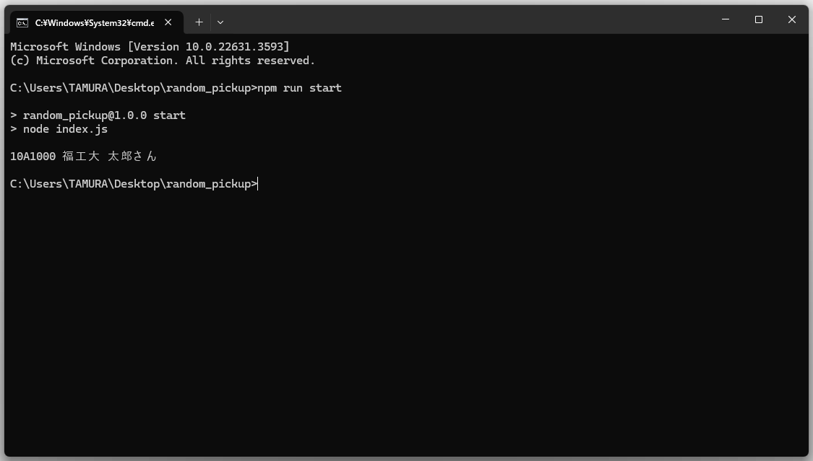
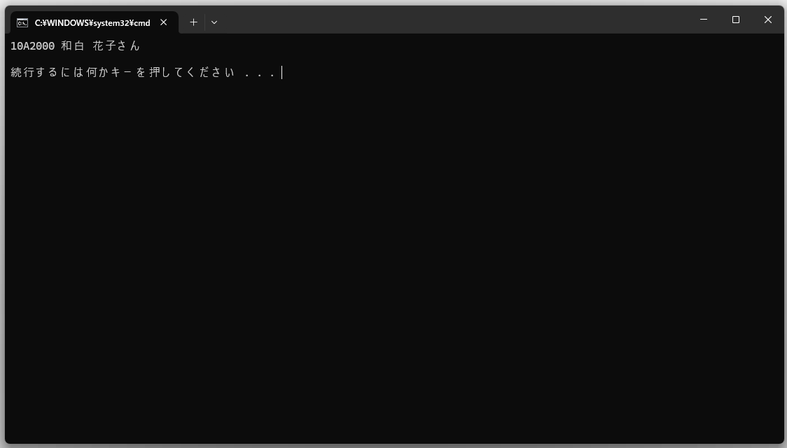

# Random Pickup
ランダムにメンバーを1人選ぶ

## 依存パッケージ
`crypto` `csv-parse`

## 使い方
1. 依存パッケージをインストールする。  
    `npm install` or `yarn install`
2. 以下の形式のCSVファイルを作成する。　　

   | student_id | name | name_kana |
   | ---------- | ---- | --------- |
   | 学籍番号   | 氏名 | 氏名かな  |
3. コードを実行する。  
    `npm run start` or `node index.js`  
    または、`start.bat`をダブルクリック

## 製作者
Sou Tamura([tmsou0209](https://github.com/tmsou0209))

## スクリーンショット

